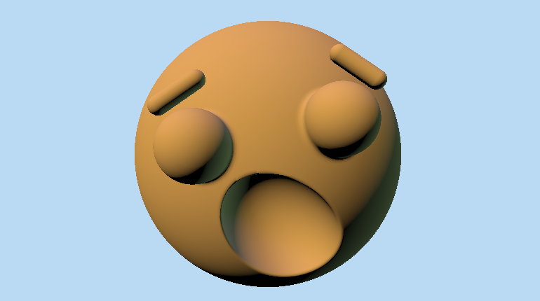
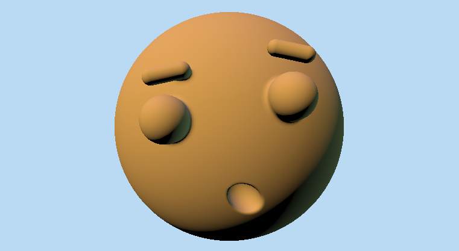

# lab06-proceduralFace

A practice of parameterization! Starting with an oh-so-beautiful gingerbread man face that looks like this:

## Parameters
SURPRISE, GOOFY, SADNESS, each ranged from 0 to 1.

## Example 1
SURPRISE = 1.0

GOOFY = 1.0

SADNESS = 1.0

 

## Example 2
SURPRISE = 0.0

GOOFY = 1.0

SADNESS = 0.3

 
